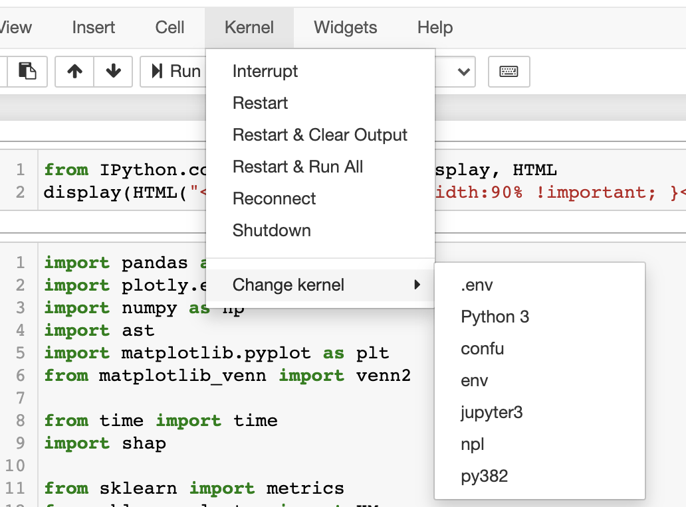

This documentation answers following question:
# How to do Python version control on a shared cluster?


## Method 1: using virtualenv + jupyter kernel

#### prepare virtualenv
Here `python` can be replaced by specified python `python3.7`, but it will be limited by which ever python version you have already installed in your machine.

```bash
virtualenv -p python env
source env/bin/activate
```

#### Install the requirements:

```bash
env/bin/python3 -m pip install --upgrade pip
env/bin/pip install -r requirements.txt
```

#### Bring up ipython notebook using python in virtualenv
```bash
env/bin/pip3 install jupyter
env/bin/ipython kernel install --name "shap3" --user
env/bin/jupyter notebook
```

Then select shap3 from kernel dropdown in jupyter to work inside of the corresponding virtualenv.


## Method 2: using pyenv
The advantage of using pyenv is that you can manage multiple Python Versions with pyenv!
[Managing Multiple Python Versions With pyenv](https://realpython.com/intro-to-pyenv/)

#### Check pyenv version to see if pyenv is installed
```bash
pyenv version
```

#### 1. Install python version you need using pyenv

Check existing versions available
```bash
pyenv install --list | grep " 3\.[6789]"
```

####  (WARNING!) Following install command failed for me
```bash
pyenv install -v 3.8.2
```
Above takes a little time to run.
I got `build failed` error when trying to install python using pyenv on mac Majove V-10.14.6, and stackoverflow gave this solution:

####  2. Install wanted version, such as python 3.8.2
```bash
SDKROOT=/Applications/Xcode.app/Contents/Developer/Platforms/MacOSX.platform/Developer/SDKs/MacOSX10.14.sdk MACOSX_DEPLOYMENT_TARGET=10.14 pyenv install 3.8.2
```

#### 3. Now check installed python versions
```bash
ls ~/.pyenv/versions/
```
Uninstalling is as simple as
```bash
rm -rf ~/.pyenv/versions/2.7.15
```
Using your new python
```bash
/Users/zruxi/.pyenv/versions/3.8.2/bin/python -V
```

#### (WARNING!) the global command does not work for me, but we can skip it for now.
If you want to use one of the python, then you can use the global command
```bash
pyenv global 3.8.2
```
If this above global command not working, try this:
```bash
eval "$(pyenv init -)"
```

#### 4. Install `pyenv-virtualenv`
```bash
brew install pyenv-virtualenv
```

#### 5. Now we can create virtualenv using python inside of pyenv folder
```bash
virtualenv -p /Users/zruxi/.pyenv/versions/3.8.2/bin/python env
```

#### 6. Install kernel named `py382` using python3.8.2
```bash
env/bin/pip install jupyter
env/bin/ipython kernel install --name "py382" --user
```

#### 7. Bring up jupyter and switch kernel to py382
<div>

</div>
